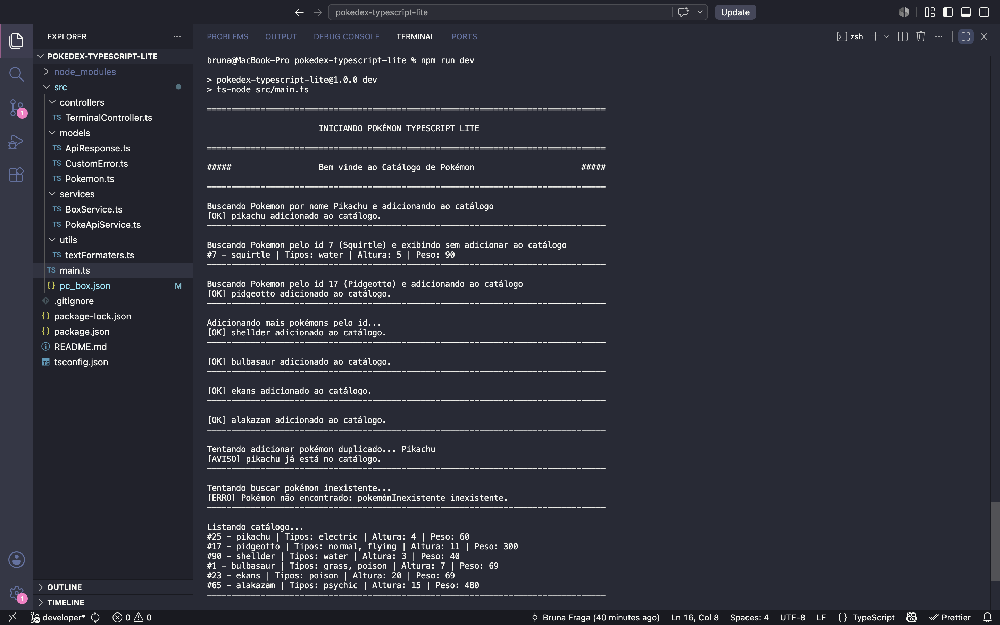
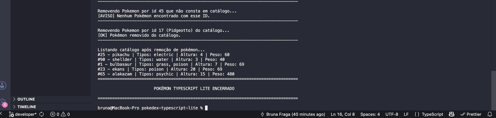
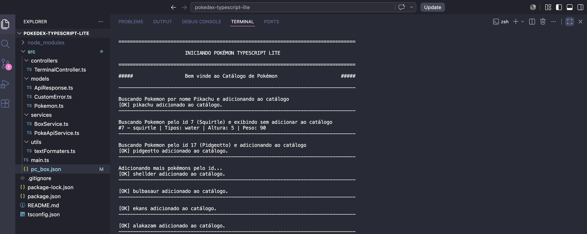
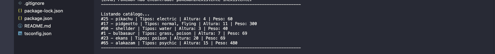
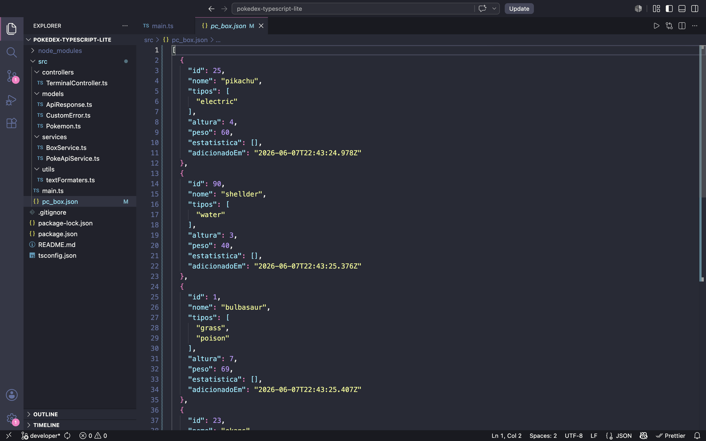

# 🐾 Pokédex TypeScript Lite

---

## 📝 Sobre o projeto

O **Pokédex TypeScript Lite** é uma aplicação simples em Node.js com TypeScript que consulta dados de Pokémon na PokeAPI e organiza alguns resultados em um catálogo local durante a execução do programa.

Este mini projeto está sendo desenvolvido como parte avaliativa do curso de **Desenvolvimento Back-end Node.js** do **SENAI**, através do programa **SC Tec** (Módulo 01 - Semana 08).

---

## 🎯 Objetivo

Praticar os principais conceitos do Módulo 01:

- Node.js
- JavaScript no back-end
- TypeScript
- Interfaces
- Funções tipadas
- Arrays
- Objetos
- JSON
- Métodos de array
- Classes
- async/await
- fetch
- Tratamento de erros
- GitHub
- GitFlow
- Kanban

---

## 🛠️ Tecnologias utilizadas

- **Runtime:** Node.js
- **Linguagem:** TypeScript (via TS-Node)
- **API Externa:** PokeAPI
- **Controle de Versão:** Git & GitHub
- **Gerenciamento:** Trello (Kanban)

---

## 📋 Pré-requisitos

Antes de executar o projeto, é necessário ter instalado em sua máquina:
- [Node.js](https://nodejs.org/)
- npm (já vem integrado ao Node)
- [Git](https://git-scm.com/)

## 🚀 Como Instalar e Executar

Siga o passo a passo abaixo para rodar o projeto localmente:

1. **Clone o repositório:**
   ```bash
   git clone https://github.com/BrunaFraga-0/pokedex-typescript-lite
   ```

2. **Acesse a pasta do projeto:**
    ```bash
    cd pokedex-typescript-lite
    ```

3. **Instale as depedências:**
    ```bash
    npm install
    ```
4. **Execute o projeto em ambiente de desenvolvimento:**
    ```bash
    npm run dev
    ```

---

## 📂 Estrutura do Projeto

A árvore estrutural do projeto adota a separação rígida de responsabilidades em camadas:

```text
└── Pokedex-Typescript-Lite/      # Pasta raíz do Projeto
    │
    ├── src/                      # Código-fonte principal da aplicação
    │   │
    │   ├── controllers/          # Camada de controle e manipulação das requisições
    │   │   └── TerminalController.ts # Orquestrador de testes e exibição no terminal
    │   │
    │   ├── models/               # Definição de estruturas de dados e interfaces
    │   │   ├── ApiResponse.ts    # Tipagens para a resposta bruta da API
    │   │   ├── CustomError.ts    # Classes de tratamento de erros personalizados
    │   │   └── Pokemon.ts        # Interfaces do modelo da entidade Pokémon
    │   │
    │   ├── services/             # Regras de negócio e integração externa
    │   │   ├── BoxService.ts     # Lógica de manipulação do banco de dados local (JSON)
    │   │   └── PokeApiService.ts # Lógica de comunicação com a PokeAPI externa
    │   │
    │   ├── utils/                # Ferramentas auxiliares e de formatação
    │   │   └── textFormaters.ts  # Função para estilizar saídas no terminal
    │   │
    │   ├── pc_box.json           # Armazenamento local simulando Banco de Dados
    │   └── main.ts               # Ponto de entrada centralizado da aplicação
    │
    ├── package.json              # Manifesto de configuração, scripts e dependências
    ├── tsconfig.json             # Manual de regras rígidas do compilador (Strict Mode)
    └── README.md                 # Documentação do projeto
```

---

## 🌟 Funcionalidades (Escopo)

- [ ] Buscar Pokémon por nome ou ID na PokeAPI
- [ ] Tratar erros de requisições para Pokémon inexistentes (Status 404)
- [ ] Transformar resposta da API em objeto simplificado
- [ ] Adicionar Pokémon a um catálogo local em memória
- [ ] Impedir Pokémon duplicado
- [ ] Listar catálogo com todos os Pokémon atualmente salvos
- [ ] Remover Pokémon do catálogo local através do identificador (ID)
- [ ] Exibir mensagens no terminal

---

## 🧪 Testes Realizados no Terminal

Abaixo estão os resultados dos testes realizados no sistema, mostrando as entradas testadas e as saídas obtidas no terminal:

### 1. Terminal
* Print do terminal com todos os testes executados.





### 2. Busca Válida por Nome/ID e Adição no Catálogo Local
* **Entrada testada:** Buscar `pikachu`, adicioná-lo ao catálogo e realizar outras buscas de Pokémon com suas respectivas adições ao catálogo com sucesso.
* **Saída obtida no terminal:**
  


### 3. Tratamento de Duplicidade
* **Entrada testada:** Tentar adicionar `pikachu` duas vezes.
* **Saída obtida no terminal:**
  


### 4. Tratamento de Busca Inválida
* **Entrada testada:** Tentar buscar por um `pokémonInexistente`.
* **Saída obtida no terminal:**
  


### 5. Listar Catálogo
* **Entrada testada:** Listar o catálogo com sucesso.
* **Saída obtida no terminal:**
  


### 6. Tratamento de Remoção Inválida
* **Entrada testada:** Tentar remover um pokémon por ID que não foi adicionado ao catálogo local.
* **Saída obtida no terminal:**
  


### 7. Remoção Válida
* **Entrada testada:** Remover um Pokémon por ID do catálogo com sucesso.
* **Saída obtida no terminal:**
  


### 8. Listar Catálogo Após Remoção de Pokémon
* **Entrada testada:** Listar o catálogo após remover um Pokémon com sucesso
* **Saída obtida no terminal:**
  


### 7. Persistência de Dados no Arquivo Local
* **Ação realizada:** Execução completa do roteiro de testes.
* **Comprovação:** Os dados não ficaram salvos apenas temporariamente na memória. O sistema gravou com sucesso as informações no arquivo físico em formato JSON, atuando como o banco de dados local. 
  


---

## 🧠 Conceitos Aplicados

Neste projeto, apliquei conceitos de lógica de programação e de back-end utilizando TypeScript. Abaixo estão os principais pontos práticos:

### TypeScript
Para ter mais segurança no código, evitei o uso do tipo `any`. Defini os tipos de todos os parâmetros que entram nas funções sejam tipagem literais ou Union Type (ex: `nomeOuId: string | number`) e também o que elas devem retornar (usando bastante o `Promise<PokemonResumo>`). Quando precisei lidar com os dados incertos vindos da API, usei o `unknown` e fiz validações com `if` para ter certeza do formato dos dados antes de aceitá-los.

### Interface PokemonResumo
A PokeAPI devolve uma lista enorme de informações sobre cada Pokémon. Para não poluir o banco de dados local, criei essa interface com o objetivo de "filtrar" e ditar as regras do que realmente importava para o projeto: salvar apenas o `id`, `nome`, `tipos`, `altura` e `peso`.

### Fetch e async/await
Utilizei a função nativa `fetch` dentro do serviço de API para ir buscar os dados na internet. Como essa busca leva um certo tempo, usei o `async/await` para fazer o Node.js esperar a resposta chegar antes de tentar rodar a próxima linha de código, tudo isso sem travar a aplicação.

### Tratamento de Erros
Para não deixar o programa simplesmente "quebrar" com mensagens vermelhas feias no terminal, criei um sistema de encapsulamento de erros através de classes personalizadas (`APIError` e `LocalBoxError`). 
* **Na Busca:** Ao realizar o `fetch`, o código verifica a propriedade `resposta.ok`. Se um Pokémon não for encontrado (ex: erro 404), o sistema não "quebra"; ele lança um erro tratado avisando que o Pokémon é inexistente, e o fluxo continua.
* **No Catálogo:** O sistema bloqueia a inserção de Pokémon duplicados verificando o ID previamente, e também informa o usuário amigavelmente caso tente remover um ID que não consta no banco local.

### Métodos de Array
Usei os métodos nativos do JavaScript para manipular as listas de forma mais limpa:
* **`map`**: Para pegar aquela estrutura complexa de tipos que vem da API e transformar numa lista simples só com os nomes dos tipos.
* **`find` / `some`**: Para verificar rapidamente se um Pokémon já existia dentro do array do catálogo antes de adicionar.
* **`filter`**: Utilizado na hora de remover, criando uma lista nova que tira apenas o Pokémon que tem o ID que foi pedido para apagar.
* **`forEach`**: Utilizado no momento de listar os Pokémon no terminal, aplicando a função de formatação de texto ao percorrer cada item do catálogo.

### Classe CatalogoPokemon
É a classe responsável por conversar com o arquivo `pc_box.json`. Como atributo, ela guarda o caminho de onde o arquivo está salvo. Como métodos, ela tem as lógicas de `adicionar`, `remover` e `listar`. Fiz isso para separar as coisas: quem busca na internet (API) não se mistura com quem salva no HD (Catálogo).

---

## 🗺️ Organização com Kanban

O planejamento das etapas de desenvolvimento foi gerenciado de forma visual através de um quadro Kanban, utilizando a ferramenta Trello.

* **Link do Quadro:** [Clique aqui para acessar o Kanban](https://trello.com/b/sqfExJnR)

---

## 🌿 Branches Utilizadas

Seguindo o fluxo do GitFlow simplificado exigido no projeto, as ramificações foram separadas em:

- `main`: Branch principal de produção para entrega final.
- `develop`: Branch secundária para integração do código.
- `feature/nome-da-feature-temporária`: Branchs temporárias isoladas para codificação das funcionalidades.
- `docs/readme`: Branch temporária isolada para evolução da documentação técnica.

---

## 🚀 Melhorias Futuras

O projeto cumpre os requisitos estruturais propostos, mas a arquitetura foi desenhada permitindo escalabilidade para as seguintes implementações, que pretendo implementar durante o curso:

* **Alinhamento Visual no Terminal:** Aprimorar as funções utilitárias de formatação de texto (aplicando métodos nativos como `padStart` e `padEnd`) para exibir as listas do catálogo em colunas perfeitamente alinhadas, no formato de tabela.
* **Refatoração do Controller para Menu Interativo:** Refatorar a classe `TerminalController` para implementar um menu de navegação contínuo no terminal. Isso permitirá que o usuário interaja com o sistema e escolha as opções dinamicamente (via teclado/números).
* **Novos Atributos:** Expandir a interface do modelo para capturar e exibir os *status base* dos Pokémon (HP, Ataque e Defesa).
* **Filtros Avançados:** Implementar métodos no serviço do catálogo para permitir a busca e listagem de Pokémon filtrados por seu tipo (ex: listar apenas Pokémon do tipo `fire`).
* **Evolução para Web API:** Migrar a interface de terminal para um ambiente web, criando uma API REST própria utilizando o framework **Express**.

---

### Criado por Bruna Fraga 👩‍💻

---